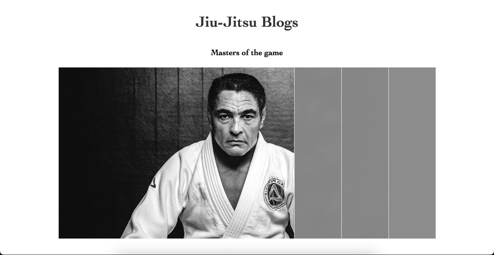

# Exam 1



The "Exam 1" project is a website used for portraying a blog within the website. The demographics are is Jiu-Jitsu practitioners and fans of the martial art.

## Description

The demographics and styling of the project were a "free-choice", and so they became for the martial arts practitioners and a very clean and simple style, respectively. The website aims to be as interactive and dynamic as possible within the realms of the assignment. This project were a product of all previously learned skills and methods from the first years languages and programs, which includes HTML, CSS, JavaScript, WordPress and Figma.

Some bullet points:

- Simple and clean style
- Demographics towards martial artists
- Interactive and dynamic with JavaScript
- A summarization of skills from my first year

## Built With

- [HTML]
- [CSS]
- [JavaScript]
- [WordPress]
- [Figma]

## Getting Started

### Installing

How to get started with the project:

1. Clone the repo:

```bash
git clone git@github.com:Ramsnes/projectExam1Private.git
```

### Running

Locate and navigate the cloned repo via the terminal using `cd` to navigate directories, and `ls` to view directories available.

To open the project in you code editor, run the following commands:

```terminal
code .
```

## Contributing

You are welcome to fork the project to review it's codes. Follow the guide below to get started.

[How to get started](https://docs.github.com/en/get-started/quickstart/fork-a-repo)

## Contact

[My e-mail](morten.ramfjord@gmail.com)
